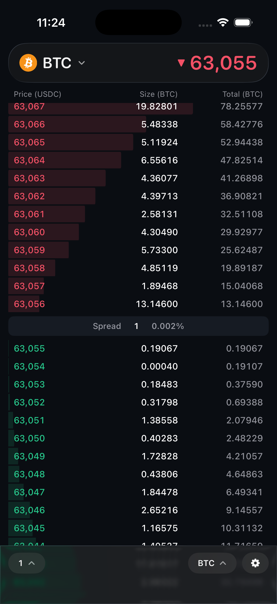
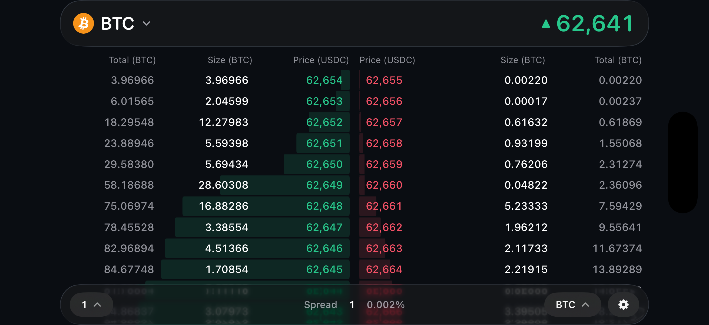

# HLOrderbook

A native iOS orderbook widget streaming the live L2 book from Hyperliquid's
websocket feed, built with Swift/SwiftUI only — no third-party dependencies.

<p>
  
</p>
<p>
  
</p>
<p>
  <em>BTC/ETH · live depth · price grouping (nSigFigs/mantissa) · level
  inspector · two-column landscape · light &amp; dark · haptics · Dynamic
  Type</em>
</p>

## Run

Open `HLOrderbook.xcodeproj` in Xcode 16+ and run the `HLOrderbook` scheme on
any iOS 17+ simulator or device. There is nothing to configure — the app
connects straight to `wss://api.hyperliquid.xyz/ws`. The glass chrome uses
iOS 26's Liquid Glass where available and falls back to a blurred material on
older systems.

## Features

- **Live L2 book** — subscribes to the `l2Book` channel; asks above, bids
  below, with the spread pinned between them. The list scrolls natively
  beneath the floating glass header and toolbar, anchored on the spread so
  deeper levels are a swipe away. Nothing renders until the first snapshot
  lands — just a spinner standing in for the price it's waiting on.
- **Unfolding** — when a book arrives the rows fan out from the spread,
  nearest first, fading in as they travel; switching market folds the old
  book back the other way, the outermost rows leaving first, so it gathers
  into the spread instead of stalling at its edges. Pure `offset` and
  `opacity` — no layout pass, and the row identities never change.
- **Two-column landscape** — past 600 pt of width the book reflows into bids
  and asks side by side, prices meeting in the middle and depth bars growing
  outward: twice the visible levels where the screen allows it. The trigger
  is width, not orientation, so iPads get it in both orientations. The spread
  moves to the centre of the toolbar, since the side-by-side book has no
  spread row.
- **Symbol selection** — BTC / ETH via a searchable market-picker sheet; the
  pattern scales past two assets (another market is one enum case away).
  Switching re-subscribes on the live socket (no reconnect) and re-centers
  the book; the choice is remembered, so the app reopens on the market last
  looked at. Coin logos are bundled from the CC0
  [cryptocurrency-icons](https://github.com/spothq/cryptocurrency-icons) set.
- **Price grouping (`nSigFigs` / `mantissa`)** — a native menu that offers
  real tick sizes (1 / 2 / 5 / 10 / 100 / 1,000 for BTC) rather than raw
  significant figures, and shows the current one unlabelled, as trading UIs
  do. Steps are derived from the current price magnitude and mapped back to
  the `nSigFigs` (and `mantissa`, for the 2× and 5× steps) the feed expects,
  applied by re-subscribing.
- **True spread** — the spread readout always shows the real market spread
  from the full-precision `bbo` stream, matching Hyperliquid: grouping is a
  display convenience and shouldn't inflate the apparent cost of crossing
  the book. Updates are sampled at most every 500 ms so the number doesn't
  strobe through re-quoting transients during fast markets.
- **Size units** — a toolbar menu shows sizes and totals either in the coin
  (BTC/ETH) or in USDC notional; switching re-renders the stored snapshot
  without touching the subscription.
- **Header price** — the mark price comes from the `activeAssetCtx` channel,
  so it stays exact regardless of how coarsely the book is grouped (a mid
  derived from $1,000 buckets would be off by hundreds). It ticks with a
  numeric text transition and colors by direction.
- **Level inspector** — press and hold a row to open a native popover with
  what it would take to sweep the book down to that depth: distance from mid,
  average fill price, and cumulative size in coin and USDC. Keep dragging and
  the inspector follows the finger from level to level, with a selection
  haptic at each one. The inspector pins the depth — "the Nth level out from
  the spread" — so as the market moves the highlight stays on the same rung
  of the ladder and every figure updates live.
- **Change feedback** — cumulative depth bars animate as liquidity moves, and
  a row flashes in its side's color when something notable happens at that
  price: a genuinely new level, or its resting size at least doubling.
  Levels that merely scroll in past the far edge of the window don't flash, so
  the effect stays rare enough to mean something.
- **Light and dark appearance** — switchable from Settings and persisted; all
  colors live in the asset catalog with per-appearance variants, so both
  themes come from one palette.
- **Settings** — a sheet off the toolbar's gear: appearance, haptics on/off,
  and what the app is subscribed to.
- **Haptics** — selection feedback when changing symbol, grouping, or units,
  and as the level inspector moves from row to row; muted from Settings.
- **Dynamic Type** — text scales with the user's setting via `@ScaledMetric`
  (row heights included), capped below the accessibility sizes where the
  book's three columns stop fitting side by side.
- **Resilience** — keep-alive pings every 45 s, automatic reconnection with
  exponential backoff, and the socket is torn down/restored as the app
  backgrounds/foregrounds.

## Architecture

```
RootView              composition root: owns the model and the feed's
                      lifecycle, then hands off to the screen.
Preferences           appearance and haptics, persisted across launches;
                      owned by the app, read through the environment.
Feed/
  Models              wire types for the frames we decode.
  HyperliquidSocket   websocket lifecycle: subscribe/unsubscribe (l2Book,
                      activeAssetCtx, and bbo per coin), pings, reconnection
                      with backoff. Emits decoded frames.
ViewModels/
  OrderbookViewModel  turns snapshots into fixed-identity row slots, coalesces
                      bursts to ≤10 UI applies/sec, pre-formats all strings,
                      and remembers the selected market.
Screens/
  OrderbookScreen     lays the header, book, and toolbar into the screen and
                      picks the ladder or two-column layout by width.
  SettingsScreen      appearance, haptics, feed info — presented as a sheet.
  MarketPickerScreen  searchable market list — presented as a sheet.
Components/
  MarketHeaderBar     market button and live mark price, on glass.
  OrderbookView       the book: ladder or columns, plus the press-and-scrub
                      inspector.
  LevelRowView        one price level; its column order and bar direction
                      adapt to ladder / left / right layouts.
  BookColumnHeader    column titles, mirrorable for the right-hand column.
  SpreadRowView       the ladder's divider showing the true spread.
  LevelStatsView      the inspector's popover contents.
  BookToolbar         grouping menu, unit menu, settings — and the spread,
                      centred, in the wide layout.
  PressAndScrub       UIKit long-press bridge that coexists with scrolling.
Design/
  Theme               palette, from the asset catalog (light + dark).
  Haptics             pre-warmed feedback with a global mute.
  GlassBackground     Liquid Glass on iOS 26, material fallback below.
```

Performance notes:

- Row slots have **fixed identities** (`ask-0` … `bid-19`), so SwiftUI updates
  text in place instead of diffing inserted/removed rows — the book stays
  visually stable while prices move.
- Frames are **coalesced**: only the latest snapshot is applied, at most every
  100 ms, so bursts never queue up stale renders; spread updates from the
  chattier `bbo` stream are sampled at 500 ms.
- Rows whose content didn't change in a snapshot **skip re-rendering**
  entirely (`Equatable` views), and the depth bar is an anchored scale
  transform — no per-row `GeometryReader`, no layout pass on change.
- All number formatting happens once per snapshot in the view model, not in
  view bodies; digits are monospaced to avoid layout jitter.
- The level inspector is **one shared popover** anchored to the selected row,
  not forty per-row presentation modifiers, and its long-press recognizer is
  a single UIKit gesture that arbitrates cleanly with the scroll view's pan.
